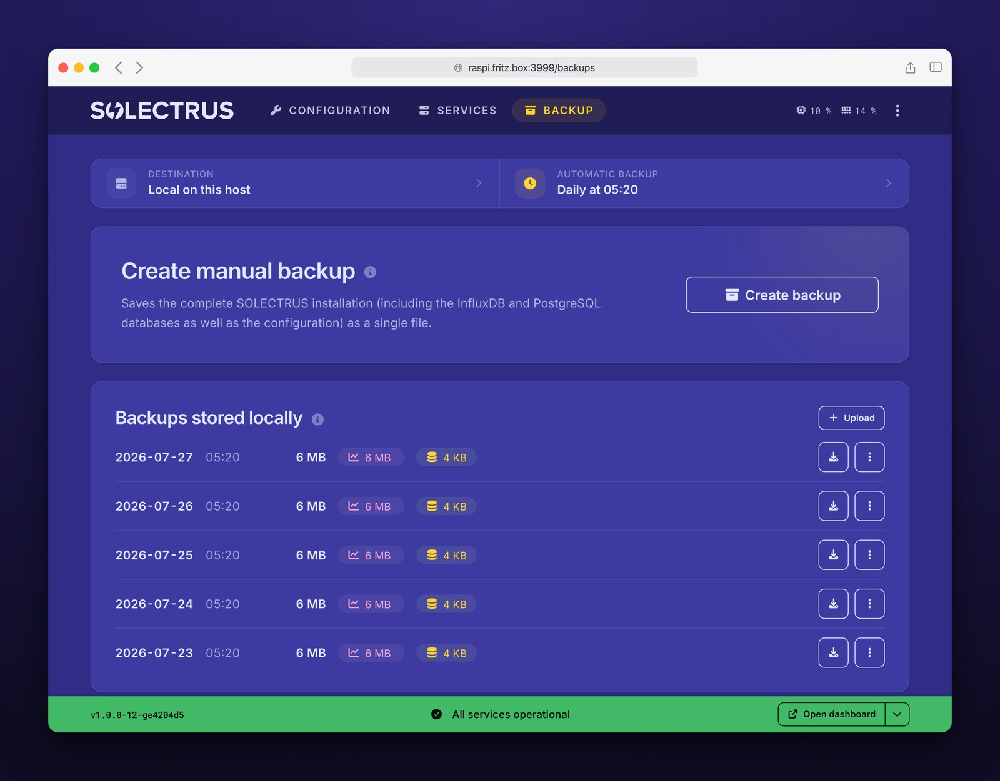

# HELIOS

Web-based control panel for [SOLECTRUS](https://solectrus.de). HELIOS installs the SOLECTRUS stack on your Docker host and lets you configure and operate it through a browser, replacing manual edits to `compose.yaml` / `.env` and `docker compose` commands.

## Screenshots

|                                  Configuration                                  |                               Services                                |                              Backup                               |
| :-----------------------------------------------------------------------------: | :-------------------------------------------------------------------: | :---------------------------------------------------------------: |
|  |  |  |

## Features

- **Service dashboard** — live status, version and health per service; start, stop and update individually or across the stack. Updates arrive in real time, no polling.
- **Guided configuration** — surveys cover every documented SOLECTRUS environment variable, with built-in connection tests. `compose.yaml` and `.env` are regenerated after every change.
- **Sensor mapping** — ~50 SOLECTRUS sensors mapped to InfluxDB fields, with live readings; MQTT topics and Shelly devices included.
- **HTTPS** — optional managed Traefik with automatic Let's Encrypt certificates, or an existing external proxy.
- **Live logs** — live tail of service logs with ANSI colors.
- **Backup and restore** — PostgreSQL, InfluxDB and configuration in one archive; on demand or daily, stored locally, on a host mount or in S3-compatible storage. Restore runs from the UI.
- **CSV import** — load historical measurements into InfluxDB, including recalculation of the daily summaries.
- **Database upgrades** — one-click major-version upgrade of PostgreSQL.
- **Auto-import** — detects an existing SOLECTRUS installation and preserves anything it does not understand.
- **Auto-updates** — Watchtower keeps all images current, including HELIOS itself.
- **Support bundle** — ZIP with configuration, logs and host snapshot, secrets redacted so it can be shared publicly.
- **Localized** — German and English.

## Requirements

- Docker and Docker Compose (v2)
- Architecture: AMD64 or ARM64 (Raspberry Pi 3/4/5, NAS, VPS, any Linux host)
- Host RAM: ≥ 1 GB, 2 GB recommended (HELIOS itself needs ~256 MB, the rest is for the SOLECTRUS services)
- Free disk: ≥ 1 GB when adding HELIOS to an existing stack, 5 GB recommended for a fresh install (the full stack pulls 3-4 GB of images, and the databases grow from there)
- Port 3999 available on the host. With managed HTTPS, Traefik additionally binds 80 and 443 (plus the InfluxDB port, if exposed)
- A directory of your choice on the host with writable `compose.yaml` and `.env` for the SOLECTRUS stack (HELIOS regenerates both)

The bootstrap script checks RAM and disk before installing and aborts below the hard minimums.

## Supported setups and limitations

HELIOS manages the SOLECTRUS stack as a plain `docker compose` project on **one Docker host**, through that host's local Docker socket. It controls only the containers on that host, keeps all data in **bind mounts** there ([ADR-0003](docs/adr/0003-bind-mounts-over-volumes.md)), and performs backups, restores, and database upgrades by exec-ing into the local containers. Everything HELIOS manages therefore lives on a single host.

Because of this, HELIOS **cannot**:

- **Spread services across multiple hosts or nodes.** The dashboard and its databases (PostgreSQL, Redis, InfluxDB) are an inseparable single-host unit. To distribute load, run the parts you want elsewhere _outside_ HELIOS.
- **Deploy to Docker Swarm.** HELIOS uses `docker compose`, not `docker stack deploy`; `deploy` / `placement` / `replicas` and Swarm labels are dropped from managed services. HELIOS can run _next to_ a Swarm as a plain-compose project on one node, but it does not orchestrate the Swarm itself.
- **Run on Kubernetes, Nomad, or other orchestrators.** Not supported.
- **Use external or managed databases** (e.g. AWS RDS, or a PostgreSQL / Redis on another host). The dashboard always connects to a local `postgresql`, `redis`, and `influxdb`. The only exception is a **remote InfluxDB**, and only on a collectors-only host (no dashboard).
- **Control a remote Docker daemon.** It needs a local `docker.sock`; pointing it at a Docker host over TCP is not supported.
- **Use named volumes or network storage as the data layer.** HELIOS writes bind mounts; a node-portable storage strategy is not generated.
- **Manage arbitrary images.** On import every service image must be on the HELIOS allowlist, otherwise the import is refused. Unrecognized services are preserved verbatim but stay unmanaged.

> [!NOTE]
> **Mixed setups are fine.** Need any of the above? Run that part outside HELIOS and let HELIOS manage the rest. HELIOS only needs full control over the SOLECTRUS stack's `compose.yaml` and `.env`, so that stack must not be managed by another tool. Take it out of the other tool and run it as a local directory containing `compose.yaml` and `.env`. Portainer, for example, will still list it, but mark it as _"This stack was created outside of Portainer. Control over this stack is limited."_ — exactly what you need.

## Installation

HELIOS runs as one service inside your SOLECTRUS Docker Compose stack. The bootstrap script handles everything — whether you're setting up SOLECTRUS for the first time or adding HELIOS to a host that already runs it.

Run the bootstrap script:

```bash
curl -fsSL https://raw.githubusercontent.com/solectrus/helios/main/bootstrap/install.sh | bash
```

What it does depends on your setup:

- **New install** — it asks where to install and offers a short menu (`/opt/solectrus`, `~/solectrus`, or the current directory), then creates that directory and sets up the stack there. The databases live here long-term, so pick a disk with enough free space.
- **Existing SOLECTRUS stack** — `cd` into the directory that holds your current `compose.yaml` and `.env` first; HELIOS detects the stack and is added in place, no menu. If you run the installer from somewhere else while the stack is running, it finds it via Docker and offers to add HELIOS there — a second, separate stack is never created (the project name and port `3999` are fixed and would collide).

When it finishes, HELIOS is available at `http://<your-host>:3999`.

> Want a specific location, e.g. a dedicated data disk? Create the directory, `cd` into it, and run the installer there — it then appears in the menu as the current directory.

> Prefer not to pipe `curl | bash`? Download `bootstrap/install.sh`, review it, and run it locally.

**Unattended install** — for a Proxmox LXC helper, CI, or any host without a terminal, opt in via environment variables so the script never prompts:

```bash
HELIOS_ASSUME_YES=1 HELIOS_ACCEPT_LICENSE=1 \
  bash <(curl -fsSL https://raw.githubusercontent.com/solectrus/helios/main/bootstrap/install.sh)
```

- **`HELIOS_ASSUME_YES`** (default `0`) — auto-confirms operational prompts (install Docker, continue below recommended specs).
- **`HELIOS_ACCEPT_LICENSE`** (default `0`) — accepts the [license](LICENSE.md) without prompting. Kept separate from `HELIOS_ASSUME_YES` on purpose, so license consent is never granted implicitly.
- **`HELIOS_QUIET`** (default `0`) — silences `docker compose pull` / `up` output.

An unattended run installs into the current directory. If it detects a SOLECTRUS stack already running in a _different_ directory, it aborts rather than create a colliding second stack or silently rewrite the live one — `cd` into that directory and re-run interactively to add HELIOS to it.

## First run

On the first visit to `http://<your-host>:3999`:

1. **Login.** Use the `ADMIN_PASSWORD` from `.env` (printed by the bootstrap script on a fresh install, or your existing one when adding HELIOS to a running stack).
2. **Existing installations only.** HELIOS shows a consent screen and auto-imports `compose.yaml` and `.env` into its internal configuration, pre-filling sensor mappings from existing env variables.
3. **Configuration wizard.** Walk through the surveys (system, devices, data sources, forecasts, reverse proxy, backup). HELIOS regenerates `compose.yaml` and `.env` after every change.
4. **Apply changes.** Services are not restarted automatically — the dashboard shows which services are affected and lets you restart them explicitly.

## Documentation

| Document                                          | Description                                |
| ------------------------------------------------- | ------------------------------------------ |
| [Product overview](docs/product.md)               | Scenarios, features, technical constraints |
| [Architecture](docs/architecture/overview.md)     | System diagram, internal storage           |
| [Docker Integration](docs/architecture/docker.md) | Compose, volumes, health checks            |
| [ADRs](docs/adr/)                                 | Architecture Decision Records              |
| [Development Guide](docs/guides/development.md)   | Local setup, testing                       |

## License

Copyright © 2026 Georg Ledermann. All rights reserved.

HELIOS is **proprietary source-available software** — not open source. The official Docker image may be pulled and operated free of charge for non-commercial, personal use; commercial use requires prior written permission. The source code is published for transparency, reference, and review only. See [`LICENSE.md`](./LICENSE.md) for the full terms ([German translation](./docs/legal/LICENSE.de.md)) and [`docs/legal/THIRD_PARTY_LICENSES.md`](./docs/legal/THIRD_PARTY_LICENSES.md) for bundled third-party components.

These terms apply to HELIOS only. [SOLECTRUS](https://github.com/solectrus/solectrus) itself remains open source under the **GNU AGPL-3.0** license.
