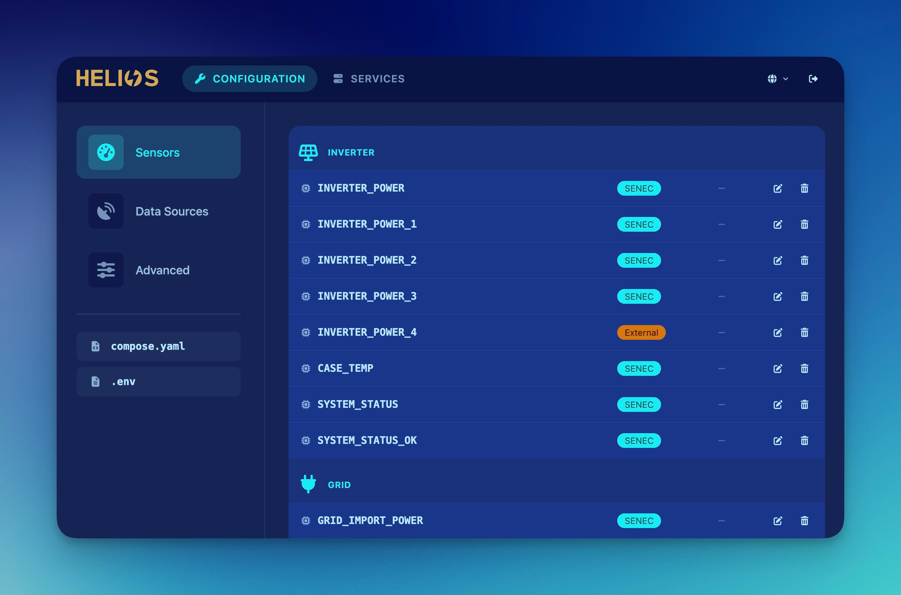

# HELIOS

Web-based bootstrap helper and management interface for [SOLECTRUS](https://solectrus.de). HELIOS eliminates the need to edit `compose.yaml` / `.env` by hand or run `docker compose` commands — install SOLECTRUS once, then configure and operate the full stack through a browser.



## Features

- **Service dashboard** — live status, versions, health for every container; start / stop / restart / recreate per service or in batch.
- **Survey-based configuration** — guided forms cover every documented SOLECTRUS environment variable (devices, data sources, forecasts, reverse proxy, backup).
- **Sensor mapping** — registry of ~40 SOLECTRUS sensors with live readings from InfluxDB.
- **Live logs** — tail and search container logs with ANSI colors directly in the UI.
- **Auto-import** — detects existing SOLECTRUS installations, reverse-maps the configuration, and preserves anything it does not understand.
- **Auto-updates** — Watchtower keeps all images (including HELIOS itself) current.
- **Real-time UI** — status updates via Turbo Streams + Action Cable, driven by the Docker events API. No polling.
- **Localized** — German and English.

## Requirements

- Docker and Docker Compose (v2)
- Architecture: AMD64 or ARM64 (Raspberry Pi 3/4/5, NAS, VPS, any Linux host)
- Port 3999 available on the host
- ~256 MB RAM for the HELIOS container

## Installation

HELIOS supports two starting points. It auto-detects which one applies on first launch.

### Fresh install

For a new SOLECTRUS setup with no existing `compose.yaml`.

1. Create a directory for the stack and generate a secret in `.env`:

   ```bash
   mkdir -p /opt/solectrus && cd /opt/solectrus
   echo "SECRET_KEY_BASE=$(openssl rand -hex 64)" > .env
   ```

2. Create `compose.yaml` with only the HELIOS service:

   ```yaml
   name: solectrus

   services:
     helios:
       image: ghcr.io/solectrus/helios:develop
       environment:
         - SECRET_KEY_BASE
       volumes:
         - .:/data
         - /var/run/docker.sock:/var/run/docker.sock
       ports:
         - 3999:3000
       restart: unless-stopped
   ```

3. Start the stack:

   ```bash
   docker compose up -d
   ```

HELIOS is now available at `http://<your-host>:3999` and will guide you through the rest of the stack configuration.

### Add to an existing installation

For hosts that already run SOLECTRUS.

1. **Set the project name.** HELIOS requires the Compose project to be named `solectrus`. Add this line at the top of your `compose.yaml` if it is not already there:

   ```yaml
   name: solectrus
   ```

   Without it, HELIOS refuses to start and shows a clear error message.

2. **Add the HELIOS service** to `compose.yaml`:

   ```yaml
   helios:
     image: ghcr.io/solectrus/helios:develop
     environment:
       - ADMIN_PASSWORD
       - SECRET_KEY_BASE
     volumes:
       - .:/data
       - /var/run/docker.sock:/var/run/docker.sock
     ports:
       - 3999:3000
     restart: unless-stopped
   ```

   No changes to `.env` are needed — `ADMIN_PASSWORD` and `SECRET_KEY_BASE` are reused from your existing SOLECTRUS setup.

3. **Recreate the stack.** Because `name: solectrus` changes the Compose project identity, recreate all containers so they are labeled correctly:

   ```bash
   docker compose down
   docker compose up -d
   ```

HELIOS is now available at `http://<your-host>:3999`.

## First run

On the first visit to `http://<your-host>:3999`:

1. **Set the admin password.** It is stored hashed in `helios/config.yaml` — HELIOS never writes it back to `.env` in plain text.
2. **Scenario detection.** HELIOS reads the current `compose.yaml` and picks one of three modes:
   - *Fresh install, standalone* — HELIOS will generate collector services to read data directly from hardware (SENEC, Shelly, MQTT).
   - *Fresh install, smart home* — data is pushed into InfluxDB by an external system (ioBroker, Home Assistant). HELIOS only provisions infrastructure services.
   - *Existing installation* — HELIOS auto-imports the current configuration and pre-fills sensor mappings from `.env`.
3. **Configuration wizard.** Walk through the surveys (devices, data sources, forecasts, reverse proxy, backup). HELIOS regenerates `compose.yaml` and `.env` after every change.
4. **Apply changes.** Services are not restarted automatically — the dashboard shows which services are affected and lets you restart them explicitly.

## Documentation

| Document                                          | Description                                |
| ------------------------------------------------- | ------------------------------------------ |
| [Product overview](docs/product.md)               | Scenarios, features, technical constraints |
| [Architecture](docs/architecture/overview.md)     | System diagram, internal storage           |
| [Docker Integration](docs/architecture/docker.md) | Compose, volumes, health checks            |
| [ADRs](docs/adr/)                                 | Architecture Decision Records              |
| [Development Guide](docs/guides/development.md)   | Local setup, testing                       |
| [Open TODOs](docs/todos.md)                       | Work items still ahead                     |

## Development

1. Install dependencies from the [Brewfile](Brewfile):

   ```bash
   brew bundle
   ```

2. Install gems, NPM packages, and create the database:

   ```bash
   bin/setup
   ```

3. Start the app locally:

   ```bash
   bin/dev
   ```

   This starts the app and opens https://helios.localhost in your default browser. On the first run, Caddy will ask for your password to install its local CA certificate.

See the [Development Guide](docs/guides/development.md) for details.

## License

Copyright © 2026 Georg Ledermann. All rights reserved.

HELIOS is currently **unlicensed** — the official Docker image may be pulled and operated for private, non-commercial purposes, but the source code is published for reference only. A formal license will follow. See [`LICENSE.md`](./LICENSE.md) for details.
