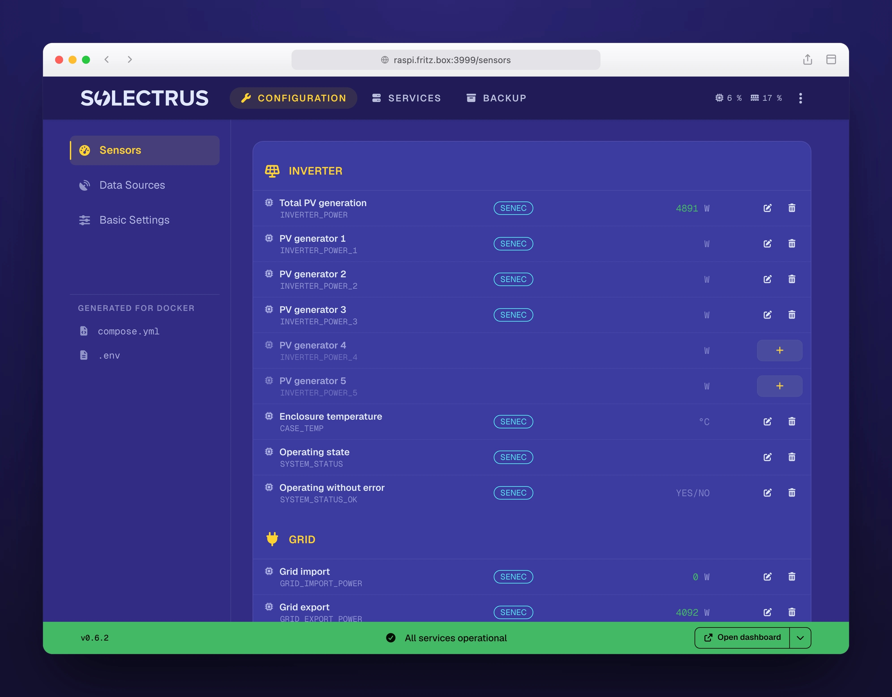
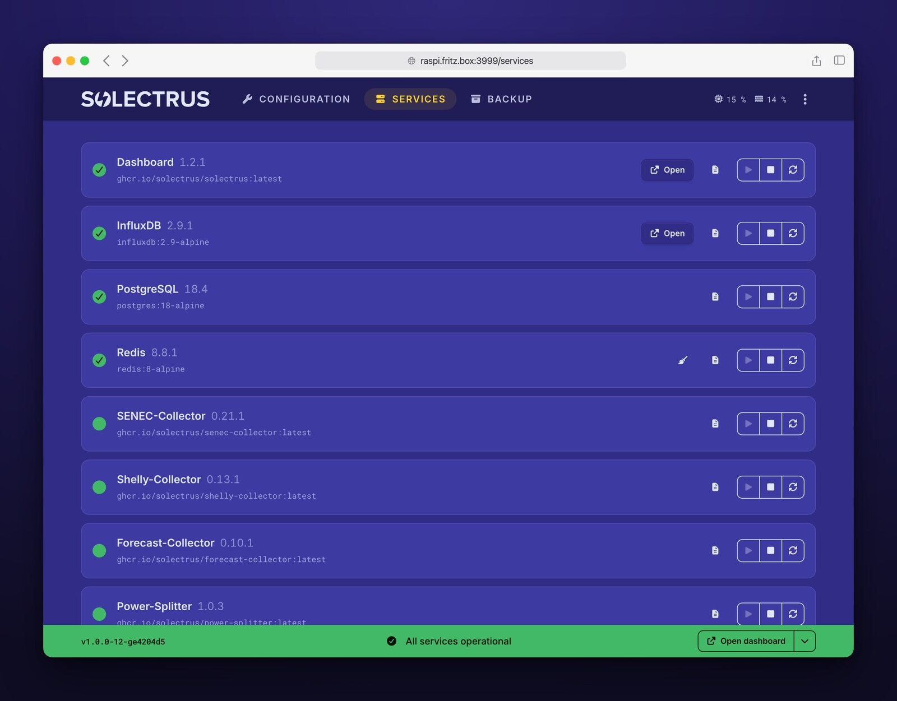

# HELIOS

Web-based control panel for [SOLECTRUS](https://solectrus.de). HELIOS installs the SOLECTRUS stack on your Docker host and lets you configure and operate it through a browser, replacing manual edits to `compose.yaml` / `.env` and `docker compose` commands.

> [!WARNING]
> **Pre-1.0 — early release, test environments only**
>
> HELIOS is usable but unfinished. Expect rough edges, missing end-user documentation, and breaking changes between 0.x releases without migration paths. There is no stability guarantee yet.
>
> **Do not use in production.** Run HELIOS only against test or evaluation stacks where data loss or downtime is acceptable. If you want to try it, you should be comfortable inspecting `compose.yaml` / `.env` yourself in case something goes wrong. For production stacks, wait for 1.0.

## Screenshots

|                                  Configuration                                  |                               Services                                |
| :-----------------------------------------------------------------------------: | :-------------------------------------------------------------------: |
|  |  |

## Features

- **Service dashboard** — live status, versions, health for every container; start / stop / restart / recreate per service or in batch.
- **Survey-based configuration** — guided forms cover every documented SOLECTRUS environment variable (devices, data sources, forecasts, reverse proxy, backup).
- **Sensor mapping** — registry of ~40 SOLECTRUS sensors with live readings from InfluxDB.
- **Live logs** — tail and search container logs with ANSI colors directly in the UI.
- **Auto-import** — detects existing SOLECTRUS installations, reverse-maps the configuration, and preserves anything it does not understand.
- **Auto-updates** — Watchtower keeps all images (including HELIOS itself) current.
- **Real-time UI** — status updates via Turbo Streams + Action Cable, driven by the Docker events API. No polling.
- **Support bundle** — download a ZIP of the current configuration, container logs, and host snapshot for troubleshooting; secrets are redacted with placeholder values so the bundle can be shared publicly.
- **Localized** — German and English.

## Requirements

- Docker and Docker Compose (v2)
- Architecture: AMD64 or ARM64 (Raspberry Pi 3/4/5, NAS, VPS, any Linux host)
- Port 3999 available on the host
- ~384 MB RAM for the HELIOS container
- ≥ 1 GB free disk for the HELIOS Docker image and local data
- A directory of your choice on the host with writable `compose.yaml` and `.env` for the SOLECTRUS stack (HELIOS regenerates both)

> [!NOTE]
> **Using Portainer or a similar Docker management tool?** HELIOS needs full control over the SOLECTRUS stack's `compose.yaml` and `.env`, so that stack must not be managed by such a tool. A mixed setup works fine: HELIOS owns the SOLECTRUS stack, the other tool keeps managing everything else. Take the SOLECTRUS stack out of the other tool and run it as a local directory containing `compose.yaml` and `.env`. Portainer, for example, will still list it, but mark it as _"This stack was created outside of Portainer. Control over this stack is limited."_ — exactly what you need.

## Installation

HELIOS runs as one service inside your SOLECTRUS Docker Compose stack. The bootstrap script handles everything — whether you're setting up SOLECTRUS for the first time or adding HELIOS to a host that already runs it.

Pick the case that matches your setup:

**a) New install** — pick a permanent location on a disk with enough free space (the databases will live here long-term, e.g. `/opt/solectrus` or `~/solectrus`), create the directory and `cd` into it:

```bash
mkdir -p /opt/solectrus && cd /opt/solectrus
```

**b) Existing SOLECTRUS stack** — `cd` into the directory that holds your current `compose.yaml` and `.env`:

```bash
cd /path/to/your/solectrus
```

Then run the bootstrap script:

```bash
curl -fsSL https://raw.githubusercontent.com/solectrus/helios/develop/bootstrap/install.sh | bash
```

When it finishes, HELIOS is available at `http://<your-host>:3999`.

> Prefer not to pipe `curl | bash`? Download `bootstrap/install.sh`, review it, and run it locally.

## First run

On the first visit to `http://<your-host>:3999`:

1. **Login.** Use the `ADMIN_PASSWORD` from `.env` (printed by the bootstrap script on a fresh install, or your existing one when adding HELIOS to a running stack).
2. **Existing installations only.** HELIOS shows a consent screen and auto-imports `compose.yaml` and `.env` into its internal configuration, pre-filling sensor mappings from existing env variables.
3. **Configuration wizard.** Walk through the surveys (system, devices, data sources, forecasts, reverse proxy, backup). HELIOS regenerates `compose.yaml` and `.env` after every change.
4. **Apply changes.** Services are not restarted automatically — the dashboard shows which services are affected and lets you restart them explicitly.

## Documentation

| Document                                          | Description                                |
| ------------------------------------------------- | ------------------------------------------ |
| [Product overview](docs/product.md)               | Scenarios, features, technical constraints |
| [Architecture](docs/architecture/overview.md)     | System diagram, internal storage           |
| [Docker Integration](docs/architecture/docker.md) | Compose, volumes, health checks            |
| [ADRs](docs/adr/)                                 | Architecture Decision Records              |
| [Development Guide](docs/guides/development.md)   | Local setup, testing                       |
| [Open TODOs](docs/todos.md)                       | Work items still ahead                     |

## License

Copyright © 2026 Georg Ledermann. All rights reserved.

HELIOS is **proprietary source-available software** — not open source. The official Docker image may be pulled and operated free of charge for non-commercial, personal use; commercial use requires prior written permission. The source code is published for transparency, reference, and review only. See [`LICENSE.md`](./LICENSE.md) for the full terms and [`docs/legal/THIRD_PARTY_LICENSES.md`](./docs/legal/THIRD_PARTY_LICENSES.md) for bundled third-party components.

These terms apply to HELIOS only. [SOLECTRUS](https://github.com/solectrus/solectrus) itself remains open source under the **GNU AGPL-3.0** license.
